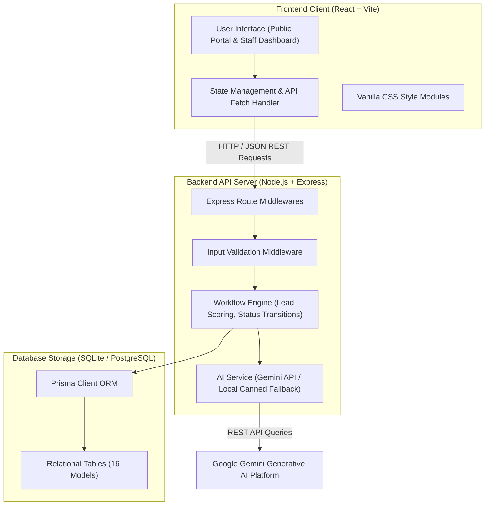

# System Architecture - Course & Program Information Portal

This document outlines the software components, network boundaries, and data flows of the Course & Program Information Portal, satisfying the Day 15 system architecture deliverables.

---

## 🏗️ Architecture Diagram

---

## ⚙️ Component Explanations

1. **Frontend Client**:
   - A single-page application built using React, Vite, and TypeScript.
   - Styled using custom vanilla CSS for modular themes and seamless transitions.
   - Communicates with the backend using the standard Javascript `fetch` API, automatically toggled between localhost and production domains.

2. **Backend API Server**:
   - A Node.js application built with Express and TypeScript.
   - Enforces validation checks on email formats, required string bounds, and phone numbers.
   - Automates workflow logic including lead prioritization, WhatsApp-style confirmation templates, and status tracking histories.

3. **Prisma ORM Database Layer**:
   - Uses Prisma Client to communicate with a local SQLite database during development and pushes schema migrations to hosted PostgreSQL during production.
   - Houses 16 models managing campus details, program catalogs, student admissions files, grades, fee payments, and system audit logs.

4. **Gemini AI Service Module**:
   - Interfaces with Google Gemini Developer SDK to generate personalized admissions advice, carrier options, and student progress reports.
   - Integrates rule-based keywords fallback routines to respond safely even when API keys are absent.
